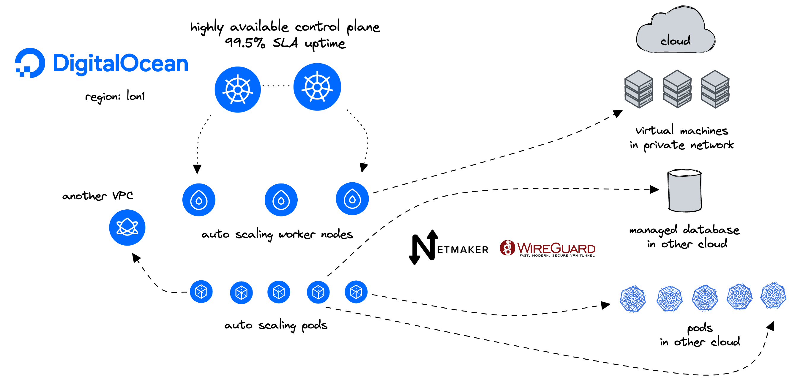

# DigitalOcean-Kubernetes-Netmaker
<!-- <div id="top"></div> -->
<!--
*** Thanks for checking out the Best-README-Template. If you have a suggestion
*** that would make this better, please fork the repo and create a pull request
*** or simply open an issue with the tag "enhancement".
*** Don't forget to give the project a star!
*** Thanks again! Now go create something AMAZING! :D
-->


<!-- PROJECT LOGO -->
<br />
<div align="center">
  <a href="https://digitalocean.com/">
    
  </a>

<h3 align="center">DigitalOcean | Kubernetes (DOKS) and Netmaker</h3>

  <p align="center">
    DigitalOcean Kubernetes (DOKS) is a managed Kubernetes service that lets you deploy Kubernetes clusters without the complexities of handling the control plane and containerized infrastructure.
    <br><a href="https://www.netmaker.org/"></a>Netmaker is a platform for creating fast and secure virtual networks with WireGuard.</b>
    <br />
    <a href="https://docs.digitalocean.com/tutorials/kubernetes/"><strong>Explore more DOKS tutorials»</strong></a>
    <br />
    <a href="https://www.digitalocean.com/product-tours/kubernetes"><strong>Quick DOKS tour»</strong></a>
  
  </p>
</div>

# Getting Started


## Architecture diagram


## Introduction

This blueprint will teach you to:

- Deploy a [Netmaker DigitalOcean Droplet](https://marketplace.digitalocean.com/apps/netmaker) to create and manage virtual networks using WireGuard
- Deploy and configure two or more DigitalOcean Droplets to act as Egress gateways for two or more DOKS clusters
- Deploy the [Static Routes Operator](https://github.com/digitalocean/k8s-staticroute-operator/), and configure static routes on your DOKS cluster worker nodes to egress workloads traffic to other DOKS clusters.
- Deploy an nginx pod and service to test connectivity
- Deploy [ExternalDNS](https://github.com/kubernetes-sigs/external-dns) to keep track of DOKS node IP changes

This blueprint is heavily based on:
- [Create Internal Load Balancer to Access DigitalOcean Kubernetes Services](https://docs.digitalocean.com/tutorials/internal-lb/)
- [Setting up a DOKS Egress Gateway using Crossplane and Static Routes Operator](https://github.com/digitalocean/container-blueprints/tree/main/DOKS-Egress-Gateway)


## Prerequisites

1. A DigitalOcean account ([Log in](https://cloud.digitalocean.com/login))
2. A Cloudflare account
3. doctl CLI([tutorial](https://docs.digitalocean.com/reference/doctl/how-to/install/))

## Step 1 - Deploy a Netmaker DigitalOcean Droplet

### Prerequisites

1.  Create a Netmaker account by logging into https://dashboard.license.netmaker.io. You will need this for a free Netmaker license.
2.  Prepare a dedicated subdomain for Netmaker, such as “nm.yourcompany.com.” We will use a wildcard from this subdomain for Netmaker.

### Initial Setup
1.  Visit https://marketplace.digitalocean.com/apps/netmaker
2.  Create a Netmaker Droplet
3.  Recommended Settings: if desired, Netmaker can run with 1GB RAM, but we recommend 2GB or larger for production
4.  Setup DNS: point the wildcard domain from the prerequisites (e.g. *.nm.yourdomain.com) to the IP of the 1-Click Droplet.
5.  Log into your Netmaker Droplet
6.  Upon login, you will be prompted with a series of steps to install Netmaker. You can use either Community or Enterprise, but we recommend Enterprise, since it has extra features and a generous free tier.
7.  Once everything looks right and you’ve hit confirm, the install script will run. This will take about 5 minutes.
8.  Log into the Netmaker dashboard at http://dashboard.yourdomain.com and create a username and password for the Netmaker server.

## Step 2 - Configure Netmaker Egress Gateways
(Can use Crossplane for this in the future) - [Example](https://github.com/digitalocean/container-blueprints/tree/main/DOKS-Egress-Gateway#step-5---creating-an-egress-gateway-using-crossplane)

We'll need a small Droplet in each VPC to act as a gateway for each DOKS cluster.

1.  Deploy a small Droplet in the same VPC as your DOKS clusters, or use an existing droplet.
2.  Use the steps to install Netclient. For instance, on Debian distros:
```shell
curl -sL 'https://apt.netmaker.org/gpg.key' | sudo tee /etc/apt/trusted.gpg.d/netclient.asc
curl -sL 'https://apt.netmaker.org/debian.deb.txt' | sudo tee /etc/apt/sources.list.d/netclient.list
sudo apt update
sudo apt -y install netclient
```
3.  Next, join the network. In Netmaker, go to the “Access Keys” section, click on the access key, and copy the “Join” command. It should look like this:
```shell
netclient join -t anvkr48twsigahkguashleawjieg
```

4. Go to your Nodes In the Netmaker dashboard
5.  Click “Create Egress Gateway” on the Egress Node
	For interface, enter ``eth1``
	For Range, enter the VPC CIDR (e.g. `10.106.64.0/20`)
6. Repeat for each VPC you want to connect

## Step 3 - Installing Static Routes Operator

Static routes operator is available as a single manifest file, and it is installed via `kubectl`. A dedicated namespace, named `static-routes`, is created as well. Please follow below steps to install the static routes controller:

1. Deploy the latest version release using kubectl. Below example is using the `1.0.0` version:

    ```shell
    kubectl apply -f https://raw.githubusercontent.com/digitalocean/k8s-staticroute-operator/main/releases/v1/k8s-staticroute-operator-v1.0.0.yaml
    ```

## Step 4 - Configuring Static Routes for your Egress Gateway

The examples below create a static route to two different VPCs. We'll apply the static routes to DOKS clusters in seperate VPCs so they can access each other via our gateways.

| Apply To Cluster | Route Name |
|--|--|
| AMS3 | static-route-destination-lon1 |
| LON1 | static-route-destination-ams3 |

* DOKS cluster in AMS3 -  10.110.0.0/20
	* The Egress Gateway Droplet is 10.110.0.4
* DOKS cluster in LON1 - 10.106.64.0/20
	* The Egress Gateway Droplet is 10.106.64.5

```yaml
apiVersion: networking.digitalocean.com/v1
kind: StaticRoute
metadata:
  name: static-route-destination-ams3
spec:
  destinations:
    - "10.110.0.0/20"
  gateway: "10.106.64.5"
```

```yaml
apiVersion: networking.digitalocean.com/v1
kind: StaticRoute
metadata:
  name: static-route-destination-lon1
spec:
  destinations:
    - "10.106.64.0/20"
  gateway: "10.110.0.4"
```

Next, save changes, and apply each manifest using `kubectl`:

```shell
# Example for ams3
kubectl apply -f static-route-ams3.yaml

# Example for lon1
kubectl apply -f static-route-lon1.yaml
```

**Hint:**

Above command will create the static route custom resources in the `default` namespace. In production environments (and not only), it's best to have a dedicated namespace with RBAC policies set.

Next, check if the static route resources were created:

```shell
kubectl get staticroutes -o wide
```

The output looks similar to (egress gateway has private IP `10.106.64.5` in below example):

```text
NAME                       DESTINATIONS         GATEWAY      AGE
static-route-destination-ams3   ["10.110.0.0/20"]   10.106.64.5   7m2s
```


## Step 5 - Testing the DOKS Cluster Egress Setup

To test your egress setup, we need to check if a pod in VPC A can access a pod in VPC B.

We will create an `nginx` deployment and a service with type `NodePort` that listens on port 31001 in both DOKS clusters

```yaml
apiVersion: apps/v1
kind: Deployment
metadata:
  name: nginx
spec:
  strategy:
    type: Recreate
  selector:
    matchLabels:
      app: nginx
  replicas: 1
  template:
    metadata:
      labels:
        app: nginx
    spec:
      containers:
      - name: nginx
        image: nginx
        ports:
        - containerPort: 80
---
apiVersion: v1
kind: Service
metadata:
  name: nginx
  namespace: default
  labels:
    app: nginx
spec:
  externalTrafficPolicy: Cluster
  ports:
  - name: http
    port: 80
    protocol: TCP
    targetPort: 80
    nodePort: 31001
  selector:
    app: nginx
  type: NodePort
```

Then, perform a `HTTP` request to this service from the other DOKS cluster by running a curl from a curl-test pod, or from [doks-debug](https://github.com/digitalocean/doks-debug) pod

```shell
kubectl apply -f https://raw.githubusercontent.com/digitalocean/container-blueprints/main/DOKS-Egress-Gateway/assets/manifests/curl-test.yaml
```
```shell
kubectl exec -it curl-test -- curl 10.106.64.3:30246
```

Or

Run a [doks-debug](https://github.com/digitalocean/doks-debug) pod on each worker node
```shell
kubectl apply -f https://raw.githubusercontent.com/digitalocean/doks-debug/master/k8s/daemonset.yaml
kubectl -n kube-system exec -it doks-debug-89txm bash
curl 10.106.64.3:30246
```

The output looks similar to:

```text
<!DOCTYPE html>
<html>
<head>
<title>Welcome to nginx!</title>
<style>
...
```

## Step 6 - Implementing ExternalDNS

Internal IP addresses can change when node pools are resized or nodes are recycled. To ensure that the NGINX service is accessible by the Droplets regardless of what the IP addresses are, you need to map the nodes’ internal IP addresses to a FQDN. Using a domain name lets the application access a service in case of changes, such as if a service moves to a new node pool. You can do this using ExternalDNS, which creates and manages DigitalOcean DNS records.

### Prerequisites
Before you begin this tutorial, do the following:

- [Generate a DigitalOcean API token](https://docs.digitalocean.com/reference/api/create-personal-access-token/) with read-write scope. This allows ExternalDNS to access the DOKS cluster.
- Obtain a domain name (if you do not have one already) and [add the DNS record to your DigitalOcean account](https://docs.digitalocean.com/products/networking/dns/quickstart/). Applications on Droplets use this domain to access the DOKS services. In this tutorial, we use example.com.

### Deploying ExternalDNS

The below example creates an ExternalDNS deployment to your DOKS cluster.

```yaml
apiVersion: v1
kind: ServiceAccount
metadata:
  name: external-dns
---
apiVersion: rbac.authorization.k8s.io/v1
kind: ClusterRole
metadata:
  name: external-dns
rules:
  - apiGroups: [""]
    resources: ["services"]
    verbs: ["get","watch","list"]
  - apiGroups: [""]
    resources: ["pods"]
    verbs: ["get","watch","list"]
  - apiGroups: ["networking","networking.k8s.io"]
    resources: ["ingresses"]
    verbs: ["get","watch","list"]
  - apiGroups: [""]
    resources: ["nodes"]
    verbs: ["get","watch","list"]
  - apiGroups: [""]
    resources: ["endpoints"]
    verbs: ["get","watch","list"]
---
apiVersion: rbac.authorization.k8s.io/v1
kind: ClusterRoleBinding
metadata:
  name: external-dns-viewer
roleRef:
  apiGroup: rbac.authorization.k8s.io
  kind: ClusterRole
  name: external-dns
subjects:
- kind: ServiceAccount
  name: external-dns
  namespace: default
---
apiVersion: apps/v1
kind: Deployment
metadata:
  name: external-dns
spec:
  replicas: 1
  selector:
    matchLabels:
      app: external-dns
  strategy:
    type: Recreate
  template:
    metadata:
      labels:
        app: external-dns
    spec:
      serviceAccountName: external-dns
      containers:
      - name: external-dns
        image: registry.k8s.io/external-dns/external-dns:v0.13.1
        args:
        - --source=service # ingress is also possible
        #- --target-net-filter=10.185.141.0/24
        - --provider=digitalocean
        - --log-level=debug
        env:
        - name: DO_TOKEN
          value: "DIGITALOCEAN_API_TOKEN"
```

In the manifest file, replace `DIGITALOCEAN_API_TOKEN` with the DigitalOcean API token you created previously.

### Add ExternalDNS annotations to your nginx service

- The `kubernetes.digitalocean.com/firewall-managed annotation` is `false`. This makes the firewall unmanaged for the NodePort service and ensures that the service is only accessible over NodePort in the private VPC network.
- The `external-dns.alpha.kubernetes.io/hostname` annotation must match the DigitalOcean DNS zone you created previously. This annotation is used by ExternalDNS to determine what services should be registered with the DNS record. Removing the annotation causes ExternalDNS to remove the corresponding DNS records.

```shell
kubectl annotate service nginx "external-dns.alpha.kubernetes.io/hostname=nginx.example.org."
kubectl annotate service nginx "external-dns.alpha.kubernetes.io/ttl=10"
kubectl annotate service nginx "external-dns.alpha.kubernetes.io/access=private"
kubectl annotate service nginx "kubernetes.digitalocean.com/firewall-managed=false"
```

## Cleaning Up

If you want to clean up all the resources associated with this guide, you can do so for each major component, as follows.

### Uninstalling the Static Routes Operator

To clean up the operator and associated resources, please run the following `kubectl` command (make sure you're using the same release version as in the install step):

```shell
kubectl delete -f https://raw.githubusercontent.com/digitalocean/k8s-staticroute-operator/main/releases/v1/k8s-staticroute-operator-v1.0.0.yaml
```

## FAQ

1. **Q:** What Linux table ID does the static routes operator use?

   **A:** The static routes operator acts on the main table (ID 254).
2. **Q:** What happens if I define same routes or overlapping subnets via separate StaticRoute CRDs?

   **A:** The static routes operator doesn't perform checks across CRDs (tracked via [#13](https://github.com/digitalocean/k8s-staticroute-operator/issues/13) on operator's GitHub repo). So, it is possible to override static routes via different CRDs.
3. **Q:** Is it possible to override routes created by the system (e.g. Cilium)?

   **A:** Yes, it is if updating existing CRDs. This doesn't happen when the CRD is created for the first time though. In the end, it's more safe to have a list of protected IPs/subnets defined in a ConfigMap. The operator will read the list at startup (or whenever it changes), and will not let users apply those routes (tracked via [#11](https://github.com/digitalocean/k8s-staticroute-operator/issues/11) on operator's GitHub repo).
4. **Q:** Am I allowed to change the default gateway?

   **A:** No. It is considered an unsafe operation which can cause trouble (tracked via [#6](https://github.com/digitalocean/k8s-staticroute-operator/issues/6) on operator's GitHub repo).

Additional resources:

- [Static Routes Operator](https://github.com/digitalocean/k8s-staticroute-operator) project page.
- [Crossplane Guides](https://crossplane.io/docs/v1.9/guides/guides.html) page.
- [DigitalOcean Droplets as NAT Gateways](https://docs.digitalocean.com/products/networking/vpc/how-to/configure-droplet-as-gateway/) tutorial.
- [Create Internal Load Balancer to Access DigitalOcean Kubernetes Services](https://docs.digitalocean.com/tutorials/internal-lb/)
- [Setting up a DOKS Egress Gateway using Crossplane and Static Routes Operator](https://github.com/digitalocean/container-blueprints/tree/main/DOKS-Egress-Gateway)


<p align="right">(<a href="#top">back to top</a>)</p>


<!-- USAGE EXAMPLES -->


<!-- CONTACT -->
# Contact

Jack Pearce, Solutions Engineer - jpearce@digitalocean.com

<p align="right">(<a href="#top">back to top</a>)</p>

